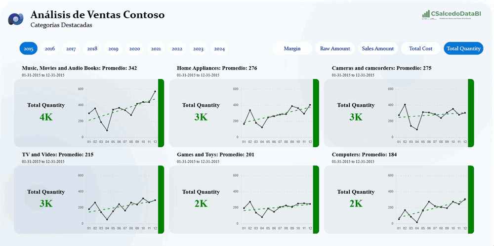
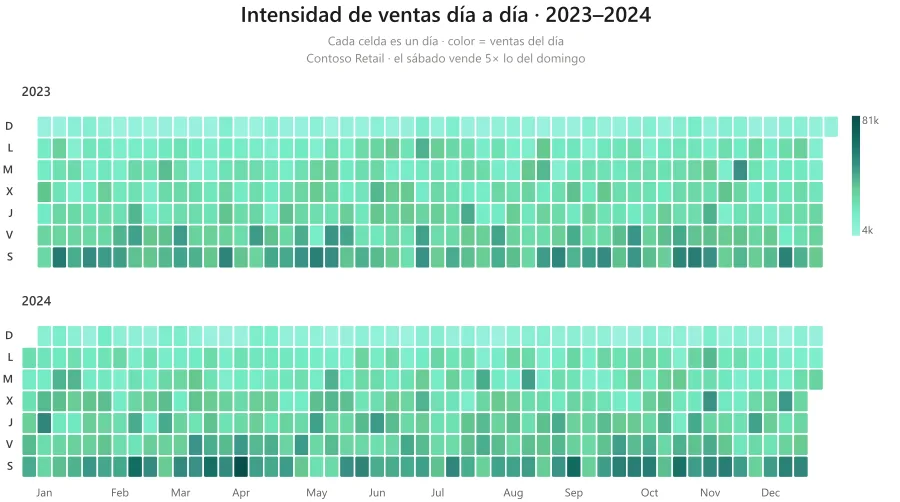
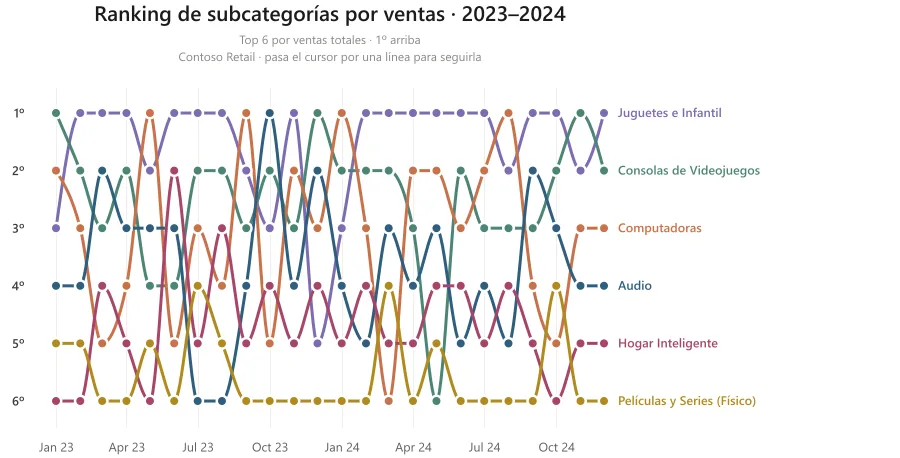

<a href="https://csalcedodatabi.com">
  <picture>
    <source media="(prefers-color-scheme: dark)" srcset="profile/banner-dark.svg">
    
  </picture>
</a>

**Business Intelligence · Power BI · Deneb / Vega · Microsoft Fabric**

Ayudo a equipos de datos a convertir modelos de Power BI y Microsoft Fabric en algo que
la gente **usa de verdad**: visualizaciones que responden preguntas, plantillas que se
copian y pegan, y automatización que quita el trabajo manual de en medio.

[Sitio](https://csalcedodatabi.com) ·
[Blog](https://csalcedodatabi.com/blog) ·
[Galería Deneb](https://csalcedodatabi.com/deneb) ·
[LinkedIn](https://www.linkedin.com/in/cristobal-salcedo) ·
[contacto@csalcedodatabi.com](mailto:contacto@csalcedodatabi.com)

<!-- actividad:start -->
**33** artículos publicados · **33** plantillas Deneb · **12** repos públicos · **534** commits en 12 meses
<!-- actividad:end -->

## Lo que hago, en imágenes

**Explorador de KPIs por categoría** — un tablero entero escrito en Deneb: eliges el año y la
métrica, y las seis tarjetas se recalculan con su tendencia.

**Mapa de calor de calendario** — 53 semanas × 7 días a partir de UNA columna de fecha.
**Ranking bump chart** — cómo se mueve el top 6 mes a mes.

Las 25 plantillas, con su spec listo para copiar, en
[csalcedodatabi.com/deneb](https://csalcedodatabi.com/deneb).

## Lo que construyo

<!-- repos:start -->
**Visualización avanzada — Deneb / Vega**

- [PowerBI-Deneb](https://github.com/CSalcedoDataBI/PowerBI-Deneb) — Plantillas Deneb listas para copiar en tus informes de Power BI. · ★ 9

**Microsoft Fabric y agentes de datos**

- [fabric-data-agents](https://github.com/CSalcedoDataBI/fabric-data-agents) — Cómo construir e instruir un Fabric Data Agent, medido y reproducible.
- [fabric-app-gallery](https://github.com/CSalcedoDataBI/fabric-app-gallery) — Plantillas de Microsoft Fabric Apps listas para ejecutar y adaptar.

**Herramientas y automatización**

- [agentic-board](https://github.com/CSalcedoDataBI/agentic-board) — Coordinador de agentes de código sobre un board real de GitHub Projects.
- [powerbi-pbip-tools](https://github.com/CSalcedoDataBI/powerbi-pbip-tools) — Automatización de proyectos Power BI en formato PBIP. · ★ 4

**Datos y retos**

- [SampleDataSets](https://github.com/CSalcedoDataBI/SampleDataSets) — Conjuntos de datos de muestra para pruebas, aprendizaje y demos.
- [BI_Challenges](https://github.com/CSalcedoDataBI/BI_Challenges) — Soluciones a retos de la comunidad BI en PySpark, Python y M. · ★ 1
- [ubl-star](https://github.com/CSalcedoDataBI/ubl-star) — De factura electrónica UBL 2.1 a un modelo dimensional analizable.

<!-- repos:end -->

## Publicado recientemente

### En el blog

<!-- blog:start -->
- [Grupos de cálculo en Power BI: su formato en Deneb](https://csalcedodatabi.com/blog/grupos-calculo-formato-deneb/) — 6 sep 2026
- [Formato dinámico con SWITCH en Power BI y Deneb](https://csalcedodatabi.com/blog/formato-dinamico-switch-deneb/) — 5 sep 2026
- [Formato de medidas en Power BI: __format en Deneb](https://csalcedodatabi.com/blog/formato-medidas-format-deneb/) — 5 sep 2026
- [dax-for-agents: DAX para que tu agente deje de inventar](https://csalcedodatabi.com/blog/dax-for-agents/) — 26 ago 2026
- [¿Prep-for-AI cambia las respuestas de un Fabric Data Agent?](https://csalcedodatabi.com/blog/fabric-data-agent-prep-for-ai-prueba/) — 23 jul 2026
<!-- blog:end -->

Todo en [csalcedodatabi.com/blog](https://csalcedodatabi.com/blog)

### Plantillas nuevas en la galería

<!-- plantillas:start -->
- [Herencia Del Formato De Medida](https://github.com/CSalcedoDataBI/PowerBI-Deneb/tree/main/Herencia_Del_Formato_De_Medida) — 3 sep 2026
- [Grupos De Calculo Formato](https://github.com/CSalcedoDataBI/PowerBI-Deneb/tree/main/Grupos_De_Calculo_Formato) — 3 sep 2026
- [Formato Dinamico Con SWITCH](https://github.com/CSalcedoDataBI/PowerBI-Deneb/tree/main/Formato_Dinamico_Con_SWITCH) — 3 sep 2026
- [Campos De Apoyo Format Y Formatted](https://github.com/CSalcedoDataBI/PowerBI-Deneb/tree/main/Campos_De_Apoyo_Format_Y_Formatted) — 2 sep 2026
- [Grilla Termometros IBCS](https://github.com/CSalcedoDataBI/PowerBI-Deneb/tree/main/Grilla_Termometros_IBCS) — 24 ago 2026
<!-- plantillas:end -->

Todas en [la galería](https://csalcedodatabi.com/deneb)

### Últimas versiones de las herramientas

<!-- releases:start -->
- [agentic-board v0.38.2](https://github.com/CSalcedoDataBI/agentic-board/releases/tag/v0.38.2) — 1 sep 2026
- [agentic-board v0.38.1](https://github.com/CSalcedoDataBI/agentic-board/releases/tag/v0.38.1) — 31 ago 2026
- [dax-for-agents v0.6.0](https://github.com/CSalcedoDataBI/dax-for-agents/releases/tag/v0.6.0) — 29 ago 2026
- [dax-for-agents v0.5.0](https://github.com/CSalcedoDataBI/dax-for-agents/releases/tag/v0.5.0) — 27 ago 2026
<!-- releases:end -->

## Cómo se mantiene esto

La línea de actividad y las tres listas de arriba las genera
[`profile/scripts/update_profile.py`](profile/scripts/update_profile.py) una vez por semana,
leyendo el RSS del sitio y la API de GitHub. Sin servicios de terceros: nada de este perfil
depende de un dominio que no sea mío. Todo lo que escribe es **texto**, no imágenes: un SVG
con texto dentro se encoge con la columna y en un móvil queda ilegible, además de invisible
para un lector de pantalla.

Este repositorio además mide el tráfico de los repos públicos de la cuenta — el detalle del
sistema de telemetría está en [`telemetry/`](telemetry/) y el histórico graficado en
[`docs/`](docs/).

## Hablemos

Estoy abierto a colaboraciones y proyectos de BI, Power BI, Deneb/Vega y Microsoft Fabric.

- [LinkedIn](https://www.linkedin.com/in/cristobal-salcedo)
- [contacto@csalcedodatabi.com](mailto:contacto@csalcedodatabi.com)

## Licencia

[MIT](LICENSE) — puedes usar, copiar y adaptar el contenido de este repositorio citando la autoría.
